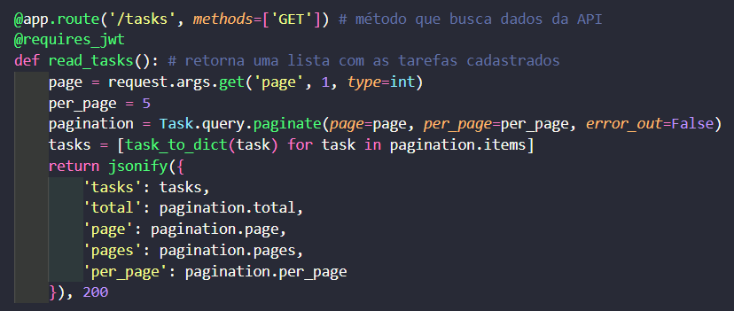

# To-do list (lista de tarefas)
Bem-vindo! Este projeto consiste numa API que gerencia uma lista de tarefas. Ela foi criada em Python, com o uso do framework Flask e de algumas bibliotecas.

## Status:
Funcionando, porém sujeito a receber novas implementações com o tempo. O projeto possui integração com SQLite para armazenamento de dados, roda num ambiente virtual e utiliza a biblioteca Waitress para dar deploy no servidor da API. No entanto, não foi feito ainda um sistema de checagem dos dados, ou mesmo de tratamento mais robusto de erros.

## Pré-requisitos:
Python 3.13
Ambiente virtual (recomendado)
Bibliotecas (para baixá-las, pip install -r requirements.txt)

## Sobre a API
Essa é uma API que faz busca e armazenamento de tarefas. Cada tarefa possui um ID, um título, um boolean que determina se a atividade foi feita e a data de criação ou atualização, obrigatoriamente. É possível que a tarefa possua uma descrição, mas não é obrigatório.

A API é feita com Flask e integrada ao SQLite, através das configurações iniciais:

A variável "app" é o que define a existência do app Flask, e a variável "db" define o banco de dados.

A classe "Task" define o modelo base pra todas as tarefas que forem criadas.
A chave primária é o ID, que é sempre um inteiro que se adiciona 1 a cada cadastro.
O título não pode passar de 60 caracteres e PRECISA existir.
A descrição pode ter até 250 caracteres, mas não é obrigatória.
A variável "done" define se a tarefa foi concluída ou não, e é False por definição.
As variáveis "created_at" e "updated_at" se atualizam conforme a data em que uma criação ou atualização é feita no banco de dados.

Após isso, temos cada função básica de consulta, que são criar, acessar, atualizar e deletar dados do banco de dados da API.

Vejamos uma por uma, começando com a função que cria tarefas.

A função busca a requisição do usuário e manda cada entrada como parâmetros para a criação de um objeto Task, que por sua vez é enviado ao banco de dados.
A função retorna ao usuário um jsonify que mostra a tarefa em forma de dicionário, com ID, título, descrição (se houver), status (feito ou não) e data de criação, e um código 201, que indica que a requisição foi bem-sucedida.

Agora, com a função que mostra todas as tarefas criadas.

A função define uma variável tasks que faz uma consulta no banco de dados para buscar objetos Task existentes.
A função retorna ao usuário um jsonify que mostra a tarefa em forma de dicionário, com ID, título, descrição (se houver), status (feito ou não) e data de criação de cada tarefa, dentro de uma lista, e um código 200, que indica que a requisição foi bem-sucedida.

Há, também, uma função que atualiza uma tarefa já existente.

A função recebe a chave primária (ID) da tarefa e faz uma consulta no banco de dados para ver se existe um objeto Task com o ID em questão.
Após isso, ela recebe a requisição na variável "data" e faz as mudanças que forem necessárias, com o método "data.get('<nome-da-chave>', task.<nome-da-chave>)", para atualizar o banco de dados logo em seguida.
A função retorna ao usuário um jsonify que mostra a tarefa em forma de dicionário, com ID, título, descrição (se houver), status (feito ou não) e data de atualização de cada tarefa, dentro de uma lista, e um código 200, que indica que a requisição foi bem-sucedida.
Caso a consulta no início da função não encontre nenhum objeto Task, é retornado um código 404, indicando erro por não encontrar a tarefa requisitada.

Por último, há a função que deleta uma tarefa.

A função recebe a chave primária (ID) da tarefa e faz uma consulta no banco de dados para ver se existe um objeto Task com o ID em questão.
Após isso, a tarefa em questão é deletada, e um jsonify com a mensagem 'Task deleted' (tarefa deletada) é retornado, junto com um código 204, que indica que a requisição foi bem-sucedida.
Caso a consulta no início da função não encontre nenhum objeto Task, é retornado um código 404, indicando erro por não encontrar a tarefa requisitada.

## Como executar o código:
1. clone o repositório, executando no terminal os seguintes comandos:
git clone https://github.com/kauaregisdev/to-do-list.git
cd to-do-list

2. crie e ative o ambiente virtual, com os comandos:
python -m venv venv
venv\Scripts\Activate
OBSERVAÇÃO: caso haja uma pasta venv/ nos arquivos do projeto, delete-a antes de criar um novo ambiente virtual!

3. instale as dependências pelo terminal, com o comando:
pip install -r requirements.txt

4. execute o app Flask, com o comando:
cd scripts
waitress-serve --port=5000 app:app

5. rode os scripts de teste em outro terminal, com o comando:
cd scripts
python test_request.py (teste usando a biblioteca requests)
pytest test_auto.py (teste automatizado usando pytest)

OU, SE POSSÍVEL:
faça as requisições HTTP direto do Postman ou do Postcode, com a URL:
http://127.0.0.1:5000/tasks
para editar uma tarefa isolada, adicionar "/" e o ID da tarefa.
EX.: http://127.0.0.1:5000/tasks/1, para editar a tarefa cujo ID é 1.

## Observações importantes:
1. A API usa SQLite para armazenar os dados, mas pretendo evoluir esse serviço de banco de dados futuramente
2. O projeto, apesar de estar funcionando, está sujeito a sofrer alterações e implementações de novas funções no futuro