# To-do list (lista de tarefas)
Bem-vindo! Este projeto consiste numa API que gerencia uma lista de tarefas. Ela foi criada em Python, com o uso do framework Flask e de algumas bibliotecas.

## Status:
Funcionando, porém sujeito a receber novas implementações com o tempo. O projeto possui integração com SQLite para armazenamento de dados, roda num ambiente virtual e utiliza a biblioteca Waitress para dar deploy no servidor da API.

## Pré-requisitos:
Python 3.13 
Ambiente virtual (recomendado) 
Bibliotecas (para baixá-las, pip install -r requirements.txt)

## Sobre a API:
Essa é uma API que faz busca e armazenamento de tarefas. Cada tarefa possui um ID, um título, um boolean que determina se a atividade foi feita e a data de criação ou atualização, obrigatoriamente. É possível que a tarefa possua uma descrição, mas não é obrigatório.

Para configurar o app, foi necessário os seguintes imports:

Após isso, são feitas as configurações de autenticação do usuário:

O username e o password corretos são definidos como constantes no cabeçalho. Após isso, são criadas funções que checam existência de autenticação e se condiz com o usuário e a senha definidos anteriormente.

Após isso, o app é configurado:

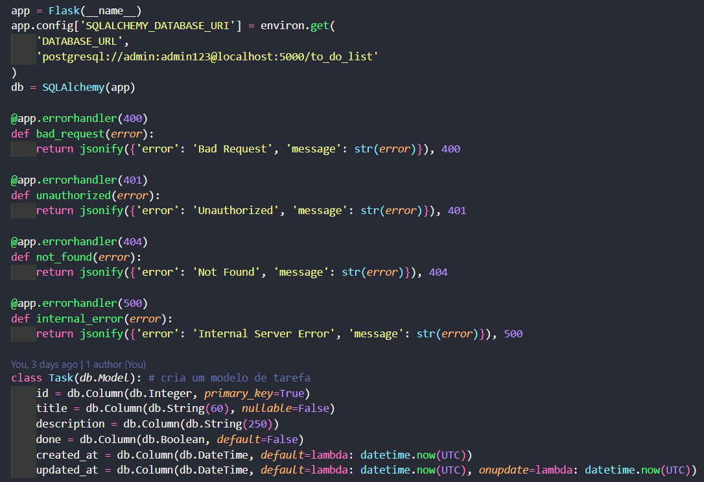

A variável "app" é o que define a existência do app Flask, e a variável "db" define o banco de dados. 
No cabeçalho, é definido também o endpoint do PostgreSQL, com o usuário, a senha e o nome do banco de dados.

A decorator "@app.errorhandler" faz tratamento de erro, dependendo do erro que deve se achar. Nesse caso, ocorre tratamento de erro para bad request, não autorizado, não encontrado ou erro de servidor.

A classe "Task" define o modelo base pra todas as tarefas que forem criadas. 
A chave primária é o ID, que é sempre um inteiro que se adiciona 1 a cada cadastro. 
O título não pode passar de 60 caracteres e PRECISA existir. 
A descrição pode ter até 250 caracteres, mas não é obrigatória. 
A variável "done" define se a tarefa foi concluída ou não, e é False por definição. 
As variáveis "created_at" e "updated_at" se atualizam conforme a data em que uma criação ou atualização é feita no banco de dados. 

Após isso, é definida uma função para agrupar as tarefas existentes:

A função "task_to_dict" recebe um parâmetro task, que representa a tarefa em si, e retorna em forma de dicionário os dados dessa tarefa: ID, título, descrição, marcador de feita e data de criação/atualização. 
Essa função será útil para o método "GET", que irá retornar todas as tarefas existentes.

Após isso, temos um bloco específico da fase de desenvolvimento da API que reinicia o banco de dados a cada vez que a API sofre deploy:

As funções "drop_all" e "create_all" irão deletar o banco existente e criar um novo, respectivamente.

Após isso, temos cada função básica de consulta, que são criar, acessar, atualizar e deletar dados do banco de dados da API. Importante ressaltar que todas as funções de consulta serão acompanhadas de duas decorators: @app.route e @requires_auth. 
A decorator @app.route define a URL em que cada função poderá ser chamada. EX.: http://127.0.0.1:8080/tasks, para "POST" e "GET". Para "PUT" e "DELETE", a mesma URL, só que adicionando "/" e o ID da tarefa. 
A decorator @requires_auth protege as rotas de cada função, obrigando o usuário a inserir um usuário e uma senha pré-cadastrados.

### Criar uma tarefa

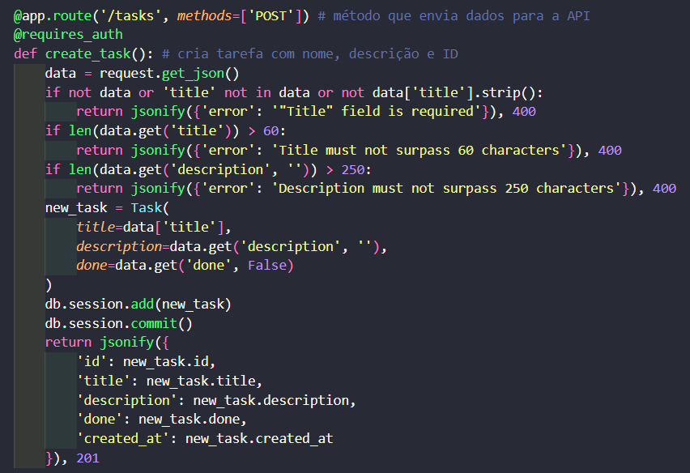

A função busca a requisição do usuário e manda cada entrada como parâmetros para a criação de um objeto Task, que por sua vez é enviado ao banco de dados. 
A função retorna ao usuário um jsonify que mostra a tarefa em forma de dicionário, com ID, título, descrição (se houver), status (feito ou não) e data de criação, e um código 201, que indica que a requisição foi bem-sucedida.

### Mostrar todas as tarefas criadas

A função define, num primeiro momento, uma variável "page" e uma variável "per_page", que irão como parâmetros numa variável "pagination", que nesse caso vai mostrar as tarefas por páginas, sendo que cada página possui até 5 tarefas. 
Após isso, é criada uma variável "tasks", que vai armazenar as tarefas existentes. A função "task_to_dict" é chamada para receber as tarefas cadastradas e retorná-las em forma de dicionário. 
A função retorna ao usuário um jsonify que mostra as tarefas na página, quantidade total de tarefas, a numeração da página específica, quantas páginas ao todo e quantas tarefas existem na página específica.

### Atualizar uma tarefa já existente

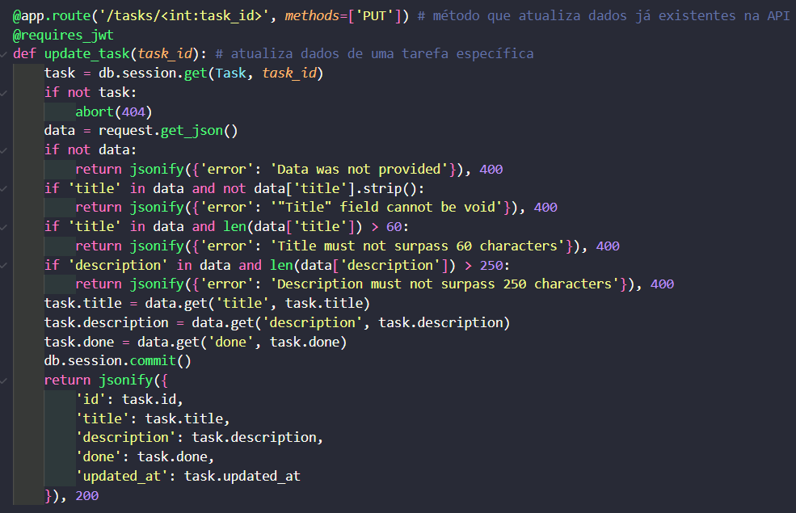

A função recebe a chave primária (ID) da tarefa e faz uma consulta no banco de dados para ver se existe um objeto Task com o ID em questão.
Após isso, ela recebe a requisição na variável "data" e faz as mudanças que forem necessárias, com o método "data.get('<nome-da-chave>', task.<nome-da-chave>)", para atualizar o banco de dados logo em seguida. 
A função retorna ao usuário um jsonify que mostra a tarefa em forma de dicionário, com ID, título, descrição (se houver), status (feito ou não) e data de atualização de cada tarefa, dentro de uma lista, e um código 200, que indica que a requisição foi bem-sucedida. 
Caso a consulta no início da função não encontre nenhum objeto Task, é retornado um código 404, indicando erro por não encontrar a tarefa requisitada. 

### Deletar uma tarefa

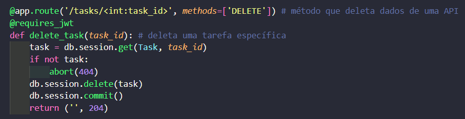

A função recebe a chave primária (ID) da tarefa e faz uma consulta no banco de dados para ver se existe um objeto Task com o ID em questão.
Após isso, a tarefa em questão é deletada, e um jsonify com a mensagem 'Task deleted' (tarefa deletada) é retornado, junto com um código 204, que indica que a requisição foi bem-sucedida. 
Caso a consulta no início da função não encontre nenhum objeto Task, é retornado um código 404, indicando erro por não encontrar a tarefa requisitada.

### Rodar o servidor

Essa condição é o que torna todo o sistema possível de ser rodado.

## Como executar o código:
1. clone o repositório, executando no terminal os seguintes comandos: 
git clone https://github.com/kauaregisdev/to-do-list.git 
cd to-do-list 

2. crie e ative o ambiente virtual, com os comandos: 
python -m venv venv 
venv\Scripts\Activate 
Caso haja uma pasta venv/ nos arquivos do projeto, esta deve ser deletada antes de criar um novo ambiente virtual.

3. instale as dependências pelo terminal, com o comando: 
pip install -r requirements.txt

4. faça o deploy local do app Flask, com o comando: 
cd scripts 
waitress-serve --port=8080 app:app

Se você fez tudo certo, a API já está funcionando a partir daqui! A resposta do terminal deve ser a seguinte:

Caso deseje encerrar o servidor, digite CTRL+C no terminal.

5. para rodar os testes com código, crie outro terminal e digite: 
activate (ou venv\Scripts\Activate) 
cd tests

Agora seu terminal para rodar os testes com código está criado.

## Como testar a API:
Você pode consumir a API pelo Postman ou pelos arquivos de teste que criei, sendo que um deles utiliza a biblioteca requests e o outro usa pytest pra rodar os testes. 
Importante ressaltar que o ambiente virtual deve estar ativo e com as dependências instaladas para rodar os testes.

### Usando Postman
<!-- editar imagens e informações -->

Primeiro, certifique-se de que você possui a extensão baixada. Caso não possua, pesquise "postman" na aba de extensões e instale-a.

Com a extensão instalada, você já pode testar a API.

1. com a API funcionando, insira no campo de URL a seguinte URL: http://127.0.0.1:8080/tasks

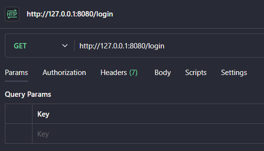

2. vá na aba "Authorization" e selecione "Basic Auth". após isso, insira "admin" como usuário e "admin123" como senha.

3. vá na aba "Headers" e digite: "content-type" como key, "application/json" como value.

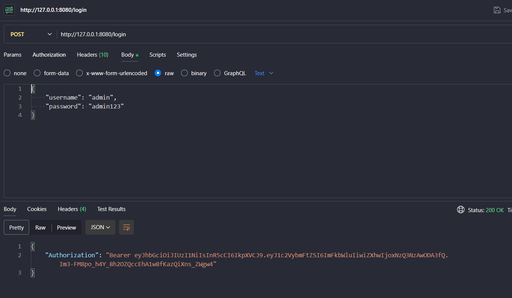

A partir daqui, já é possível executar o método "GET", pois ele não recebe nenhum parâmetro.

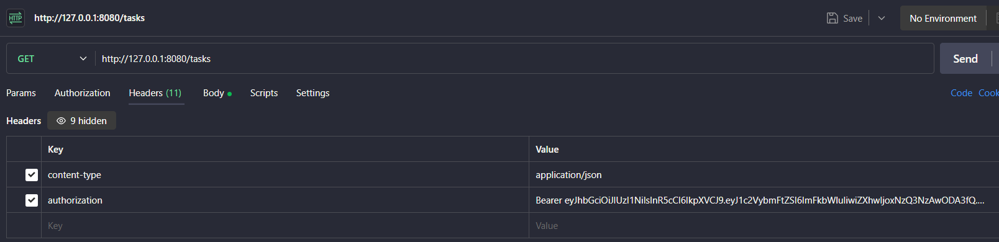

4. Caso queira executar o método "POST", selecione o mesmo no menu ao lado do campo de URL. após isso, vá ao body e selecione "raw". uma vez selecionado, você pode inserir os dados que desejar (título, descrição e marcar como feito ou não) em formato JSON, mas tome cuidado com as condições. O resultado deve ser o seguinte:

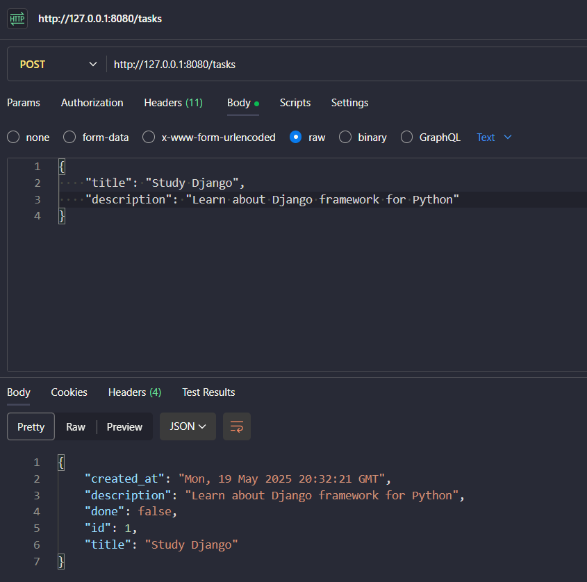

5. Para executar os métodos "PUT" e "DELETE", é preciso adicionar "/" e o ID da tarefa à URL. EX.:

O método "DELETE" não necessita nenhum parâmetro a mais, diferente do método "PUT".

6. Para executar o método "PUT", o processo é semelhante ao processo do método "POST": selecione o mesmo no menu ao lado do campo de URL. após isso, vá ao body e selecione "raw". uma vez selecionado, você pode alterar os dados que desejar (título, descrição e marcar como feito ou não) em formato JSON, mas tome cuidado com as condições. O resultado deve ser o seguinte:

### Usando requests
Você já deve possuir a biblioteca requests instalada no ambiente virtual. Portanto, você já pode testar a API.

1. importe a biblioteca requests e crie variáveis "url" e "json". Essas variáveis serão o endpoint de login da API (http://127.0.0.1:8080/login) e um dicionário com o usuário "admin" e a senha "admin123". 
Em seguida, execute o método "POST" e guarde a resposta numa variável "headers" em formato JSON.

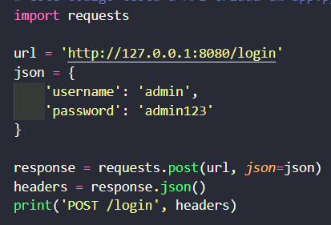

2. crie uma variável "url" que vai armazenar a URL principal da API: http://127.0.0.1:8080/tasks. Em seguida, crie um dicionário "json" contendo pelo menos o título da tarefa. Esse dicionário é a sua tarefa, que será enviada para o banco de dados.

3. após isso, você pode realizar os métodos "POST", para enviar para o banco de dados a tarefa que você criou, e "GET", para ver quantas tarefas existem.

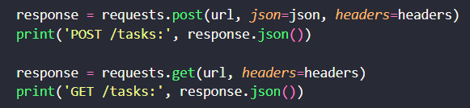

4. para utilizar os métodos "PUT" e "DELETE", você precisará adicionar "/" e o ID da tarefa à URL. EX.: http://127.0.0.1:8080/tasks/1. Caso deseje, você pode alterar a tarefa que você criou ao alterar o dicionário que você criou no cabeçalho do código.

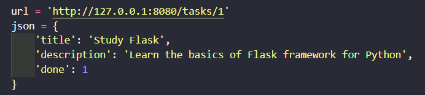

Eu optei por alterar a variável antiga, mas você também pode criar novas variáveis.

5. com a URL nova, é possível realizar os métodos "PUT", para atualizar a tarefa que você enviou anteriormente pro banco de dados, e "DELETE", para deletar essa mesma tarefa.

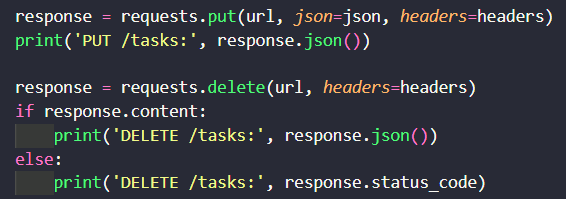

6. no terminal para rodar os códigos que você criou, digite: 
python nome-do-arquivo.py (EX.: python test_request.py)

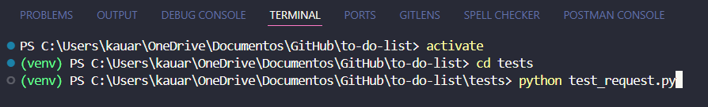

### Usando Pytest
Você já deve possuir a biblioteca Pytest instalada no ambiente virtual. Portanto, você já pode testar a API.

1. faça as importações necessárias:

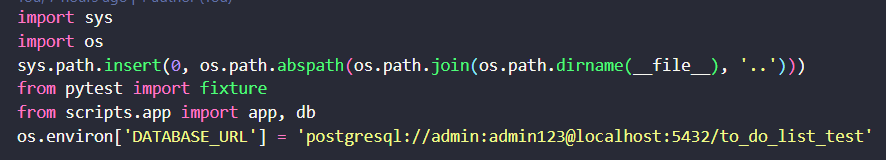

Os imports "sys" e "os" servem para que o terminal reconheça a pasta "scripts" no PATH. Importante destacar que outras máquinas podem não precisar que seja feito isso. 
A decorator "fixture" é o que vai garantir que os testes sejam feitos. 
As variáveis "app" e "db" representam a API REST, que é o app Flask em si, e o banco de dados PostgreSQL ao qual a API está integrada, respectivamente. 
A função "environ" define o endpoint do PostgreSQL, assim como no arquivo da API.

2. antes de rodar cada teste, crie as funções de autenticação:

Essas funções garantirão que a autenticação será feita e bem-sucedida em cada requisição.

3. defina uma função cliente. Essa função será o motor do teste de todas as requisições HTTP que você fará.

4. A partir daqui, o ideal é definir funções para todos os retornos possíveis, incluindo erros específicos que forem relacionados a checagens específicas da API.

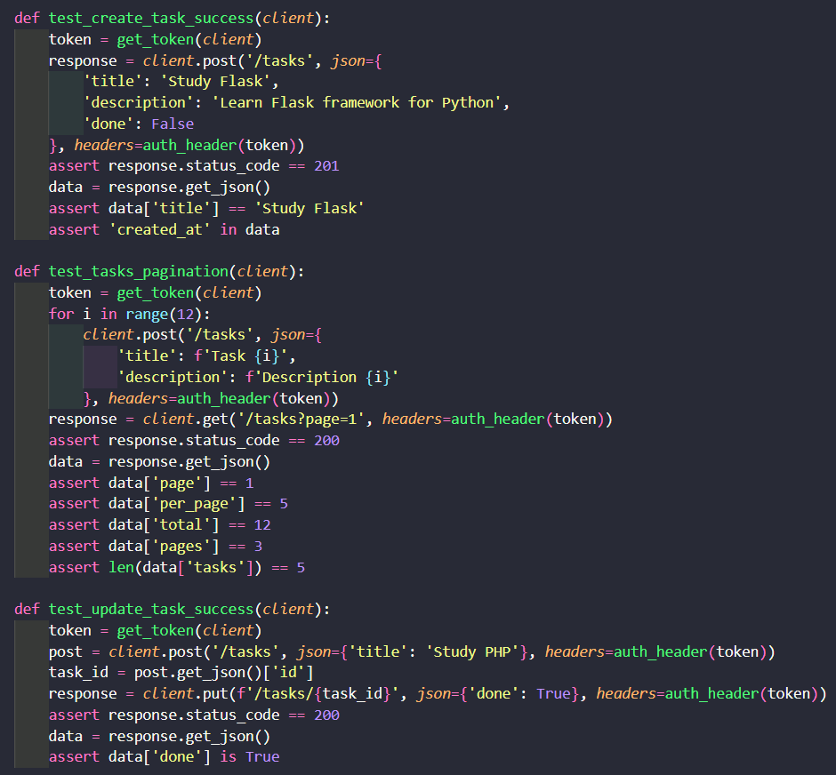

As funções acima testam se os métodos CRUD estão sendo bem-sucedidos.

As funções acima checam se há tratamento de erros específicos, como falta de título da tarefa, quebra de limite de caracteres, tentativa de edição de tarefa inexistente, entre outros.

O parâmetro "json" de qualquer uma das funções pode ser alterado, desde que respeite o intuito de cada função. EX.: uma função cujo retorno esperado é um erro específico não pode receber parâmetros que não causem o erro esperado.

5. no terminal para rodar os códigos que você criou, digite: 
pytest nome-do-arquivo.py (EX.: pytest test_auto.py)

Todos os testes devem ser bem-sucedidos. Ignore warnings, caso haja.

## Observações importantes:
1. O projeto, apesar de estar funcionando, está sujeito a sofrer alterações e implementações de novas funções no futuro